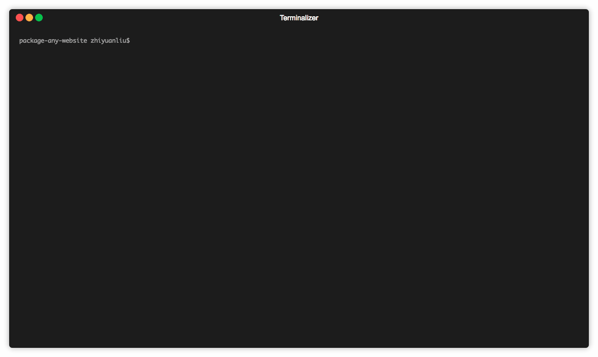

# package-any-website

A simple way to package desktop applications.



## Getting Started

### Clone this repo
```
git clone https://github.com/rmlzy/package-any-website.git
```

### Installing Dependencies

A step by step series of examples that tell you how to get a development env running

Say what the step will be

```bash
cd package-any-website
yarn install
```

### Run `start` script

```bash
npm start

# Then answer the questions according to the prompt.
```

## Built With

* [electron](https://github.com/electron/electron) - The cross-platform framework used
* [electron-builder](https://github.com/electron-userland/electron-builder) - A package tool
* [shelljs](https://github.com/shelljs/shelljs) - Run shell commands in node.js

## License

WTFPL
